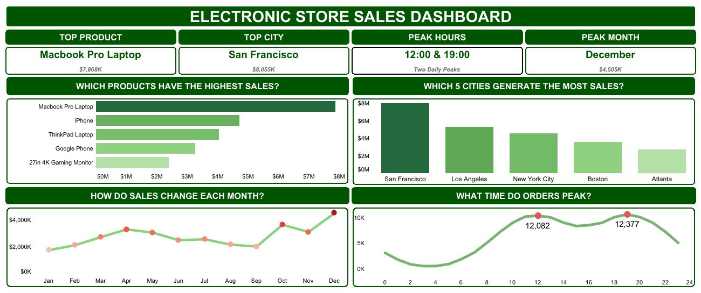

# ELECTRONIC STORE SALES ANALYSIS


An end-to-end sales analysis project built with **Power Query, Excel Pivot Tables/Charts,** and **Tableau**. The goal was to practice the full analyst workflow, cleaning raw data, analysing and presenting findings using the electronics store 2019 sales records.

---

**Live Dashboard:** [Electronic Store Sales Dashboard](https://public.tableau.com/shared/FDTY34F9C?:display_count=n&:origin=viz_share_link)

**Excel Workbook:** [`Sales_Analysis.xlsx`](./Sales_Analysis.xlsx)

## Question:

> Which product, city and time of day generate the highest sales and does that pattern change month to month accross the year?

_Knowing the answer helps a business decide **what to promote, where and when** so marketing spend isn't wasted_

## Dataset

- **Source**: [KeithGalli's Pandas Data Science Tasks](https://github.com/KeithGalli/Pandas-Data-Science-Tasks)
- **Period:** 12 months (2019)
- **Original Columns:** Order ID, Product, Quantity Ordered, Price Each, Order Date, Purchase Address

## Process

### 1. Data Cleaning (Power Query)

- Removed duplicate rows and blank/null records
- Corrected data types (numbers, dates, text)
- Combined all 12 monthly CSV files into one table

#### Derived Columns (Power Query)

| Column                    | Derived From              | How                                                                | Why                                                     |
| ------------------------- | ------------------------- | ------------------------------------------------------------------ | ------------------------------------------------------- |
| Sales                     | Price \* Quantity Ordered | Custom column                                                      | Gives total revenue per line item                       |
| Order Hour                | Order Date                | Extracted Hour                                                     | Need to find peak shopping times                        |
| Month Name / Month Number | Order Date                | Extracted month                                                    | Need to spot seasonal trends                            |
| Address 1, City, ZIP Code | Purchase Address          | Split by comma                                                     | Need City as its own field to analyze sales by location |
| Order Size                | Quantity Ordered          | Grouped into Single item, Small, Bulk                              | Helps compare small vs bulk purchases                   |
| Group Hours               | Order Hour                | Grouped into time blocks (Morning, Afternoon, Evening, Late Night) | Makes hourly patterns easier to read                    |

### 2. Data Analysis (Excel Pivot Tables & Charts)

Six Pivot Tables and Two Charts were built.

- **Product Performance Table** --> Total sales and orders by product per order size
- **City Performance Table** --> Total sales, order count and average sale per city
- **Hour Performance Table** --> orders by hour of day
- **Hour Sales Performance Chart** --> visualizaing the hourly pattern
- **Monthly Trend Table** --> sales by month
- **Monthly Sales Performance Chart** --> visualizing the seasonal pattern
- **Peak Sales Hours** --> Top-performing hours combined with order size
- **City-Product-Time Breakdown** --> cross-tab of top products by city and time of day

### 3. Data Visualization (Tableau)

_Click the dashboard image to view the interactive Tableau dashboard._

[](https://public.tableau.com/shared/FDTY34F9C?:display_count=n&:origin=viz_share_link)

## Key Findings

- **TOP PRODUCTS:** The Macbook Pro Laptop ($7.85M) and iPhone ($4.70M) are top two products by sales and both are purchased as Single Item orders. This means marketing for these products should focus on driving getting someone to buy at all and not on cross-sell or bundle offers.

- **TOP CITY ≠ BEST CUSTOMER VALUE:** The San Francisco generates the most total sales ($8.06M) and the most orders (42,898) but the Sales per Order ($187.77) is actually lower than New York City ($191.51) and other cities. This means that San Francisco lead reflects market size not higher-spending customers.

- **TWO DAILY SHOPPING PEAKS:** The Orders are lowest overnight and climb toward two distinct peaks which is late morning and evening. This suggests two separate shopping windows rather than one steady climb can be worth targeting with separate campaigns.

- **CLEAR HOLIDAY SEASON:** December sales ($4.51M) are more than double January ($1.78M) and are the highest than any month and with October ($3.65M) as a secondary peak. This points to a clear holiday-driven seasonal pattern worth planning inventory and spending around.

- **BATTERIES DON'T SCALE WELL:** AA and AAA Batteries have among the highest unit-order counts in all Order Size categories but even in their best-case Bulk Order they generate only $1,728-$4,105 combined which a fraction of what a single high-ticket product category brings in. Bulk purchase promotions are not an effective lever for these products.

- **EVENING DRIVES THE PEAKS:** Across the cities, Macbook Pro Laptop and iPhone generate their highest revenue in the Evening this confirm that the daily sales peak identified in Hour performance is being driven primarily by premium product purchases, not accessories.

## Recommendation

Based on the analysis, the business should:

1. **Focus premium product ads (MacBook Pro, iPhone) in the evening,** since that's when high purchases are already happening
2. **Run two separate daily campaigns** one for the late-morning window and one for the evening window instead of one all-day campaign
3. **Increase marketing spend heading into October-December** to capture the holiday demand spike and scale back in slower months like January
4. **Treat San Francisco as a volume market not a high-value market** pair it with cities like New York where the average order value is higher
5. **Avoid bulk-buy promotions for low-cost accessories** like batteries, the revenue upside is too small ot justify the discount

## Tools Used

| Tools          | Purpose                                                        |
| -------------- | -------------------------------------------------------------- |
| Power Query    | Data cleaning, merging monthly files, creating derived columns |
| Excel          | Pivot tables and Pivot Charts for analysis                     |
| Tableau Public | Interactive dashboard for visualization                        |

## Repository Structure

```
├── data/
│   └── Raw Sales Data
│   │   ├── Sales_January_2019.csv
│   │   ├── Sales_February_2019.csv
│   │   ├── Sales_March_2019.csv
│   │   ├── ...
│   │   └── Sales_December_2019.csv
│   └── Clean_Sales_Data.xlsx
├── Sales_Analysis.xlsx
├── images/
│   └── ES_Dashboard.png
└── README.md
```

## About This Project

This project was built as a hands-on way to practice a full analyst workflow from start to finish, cleaning messy raw data in Power Query, analyzing it with Excel pivot tables and charts, and presenting the results in an interactive Tableau dashboard.
